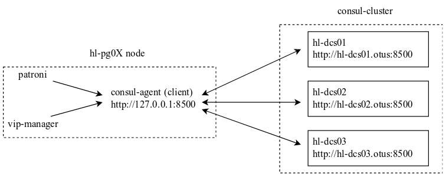

# Проектная работа "организация стенда отказоустойчивого web-приложения (Zabbix) с оптимизацией под highload"

## Задача

> организация HighLoad стэнда\
> поднимаем вебпроект\
> строим нагрузочное тестирование\
> делаем скрипты для оптимизации инфраструктуры
> 1) sysctl
> 2) кластеризация веба
> 3) оптимизация, проксирование и кластеризация базы

Проект носит исследовательский характер, поэтому для целенаправленного усложнения мною выбран Zabbix, как вариант многокомпонентного ПО не предназначенного для работы с большим количеством http-трафика. Таким образом, "высокая нагрузка" окажется очень близко и не стоит ожидать даже 500 http-rps (запросов в секунду). Так же, кластеризация компонентов под высокие нагрузки была модернизирована для сохранения полностью работоспособной отказоустойчивой конфигурации (HA) всего проекта. При работе над проектом не было цели вносить оптимизации специфичные для Zabbix.

## Описание стенда

### Схема стенда


### Описание серверов

<details><summary>таблица с описанием серверов (нажать, чтобы открыть)</summary><p>

| hostname                     | ip-адрес                                                 | функциональная роль                                          | ключевое используемое ПО                                     | комментарий                                                  |
| ---------------------------- | -------------------------------------------------------- | ------------------------------------------------------------ | ------------------------------------------------------------ | ------------------------------------------------------------ |
| hl-client                    | 10.51.21.70                                              | точка входа web-клиентов, источник http-трафика для нагрузочного тестирования | docker, yandex.tank                                          | для использования сервиса [Overload𝛃](https://overload.yandex.net/) требуется создать свой файл с токеном |
| hl-balancer01                | 10.51.21.51, 10.51.21.50 (VIP)                           | балансировщик http-трафика, master keepalived                | haproxy, keepalived                                          |                                                              |
| hl-balancer02                | 10.51.21.52, 10.51.21.50 (VIP)                           | балансировщик http-трафика, backup keepalived                | haproxy, keepalived                                          |                                                              |
| hl-zabbix01                  | 10.51.21.57, 10.51.21.56 (VIP)                           | активный web-сервер фронтенда zabbix, бэкенд (zabbix-server) с VIP-адресом, мониторинг параметров БД текущего лидера в кластере postresql | nginx, php-fpm, zabbix-server-pgsql, zabbix-web-pgsql, mamonsu, pacemaker |                                                              |
| hl-zabbix02                  | 10.51.21.58, 10.51.21.56 (VIP)                           | активный web-сервер фронтенда zabbix, бэкенд (zabbix-server) с VIP-адресом, мониторинг параметров БД текущего лидера в кластере postresql, репозиторий mamonsu | nginx, php-fpm, zabbix-server-pgsql, zabbix-web-pgsql, mamonsu, pacemaker |                                                              |
| hl-pg-conpool01              | 10.51.21.54, 10.51.21.53 (VIP)                           | пулер соединений для postgresql, репозиторий odyssey и vip-manager, master keepalived | odyssey, keepailved, nginx                                   |                                                              |
| hl-pg-conpool02              | 10.51.21.55, 10.51.21.53 (VIP)                           | пулер соединений для postgresql, backup keepalived           | odyssey, keepailved                                          |                                                              |
| hl-pg01, hl-pg02, hl-pg03    | 10.51.21.65, 10.51.21.66, 10.51.21.67, 10.51.21.68 (VIP) | реплика кластера patroni/postgresql, инстанс vip-manager     | patroni, postgresql, vip-manager, consul-agent (client)      |                                                              |
| hl-dcs01, hl-dcs02, hl-dcs03 | 10.51.21.61, 10.51.21.62, 10.51.21.63                    | DCS, key/value storage, service discovery, нода кластера consul | consul-agent (server)                                        | service dicovery настроен, но в проекте не задействован      |
</p></details>

В процессе работы над проектом на сервере zabbix был настроен сбор основных показателей ОС со всех хостов и мониторинг основных показателей БД текущего лидера кластера patroni/postgresql. Соответственно, при проведении тестов можно было наглядно увидеть нагрузку на все хосты и на БД.

На ранних этапах работы над проектом в качестве точки входа в БД использовался HAProxy (описано в тестах), а в качестве key/value хранилища - etcd. Для усложнения проекта и изучения работы похожего по функциональности ПО haproxy был заменён на [vip-manager](https://github.com/cybertec-postgresql/vip-manager) (VRRP через DCS для управления VIP-адресом кластера patroni), а etcd на гораздо более функциональный consul. Так же, в качестве пулера соединений и по результатам тестов был выбран [odyssey](https://github.com/yandex/odyssey) от Яндекса, как более функциональный аналог pgbouncer.

Для экономии ресурсов пулер соединений postgresql (odyssey) и кластер DCS (consul) можно было бы разместить на одних серверах или даже на серверах с БД. Но мониторинг ресурсов серверов во время тестов показал активное использование ЦП odyssey`ем и небольшое но постоянное ожидание дискового ввода-вывода на серверах кластера consul. С учётом большой нагрузки на серверах БД во время тестов, очевидно, что было бы не оптимальным размещение на одних серверах даже пулера соединений и кластера DCS, не говоря уже про БД. Тем не менее, такой подход вполне разумен и даже желателен, если не планируется активное использование БД.

Т.к. в проекте все компоненты отказоустойчивые, развёрнутый стенд успешно переживает остановку любого или всех мастер-серверов.

<details><summary>ansible (нажать, чтобы открыть)</summary><p>
Для провижининга на хостовой машине требуется ansible >= 2.9, т.к. в модуле <code>mount</code> используется параметр <code>state</code>  со значением <code>remounted</code> .

Роли для провижининга на стенд Vagrant расположены в каталоге [provisioning](provisioning/).

Роли для провижининга на стенд Proxmox расположены в каталоге [provisioning_proxmox](provisioning_proxmox/).

В плейбуках ansible используются переменные, которые описаны в файле [variables](provisioning/variables) для Vagrant и в файле [variables](provisioning_proxmox/variables) если используется вариант для Proxmox. Если нужно изменить имя сервера, то кроме файла variables необходимо проверить файл [hosts](provisioning_proxmox/hosts), [hosts_ip](provisioning_proxmox/hosts_ip) или [hosts_vagrant](provisioning/hosts_vagrant) если используется vagrant.

При выполнении роли [08_zabbix/04_zabbix_createDB](provisioning/roles/08_zabbix/04_zabbix_createDB/tasks/main.yml) (пример для Vagrant) происходит удаление и повторное создание БД и пользователя zabbix в postgresql, если эти объекты ранее существовали. Если этот функционал не нужен, то можно это закомментировать.
</p></details>

<details><summary>web (zabbix) (нажать, чтобы открыть)</summary><p>
Для реализации распределения и балансировки http-трафика web-части сервера zabbix расположены на разных ВМ но настроены на работу с одним zabbix-server. При этом, отказоустойчивость web реализована избыточностью ВМ, а отказоустойчивость zabbix-server и mamonsu с помощью pacemaker/corosync.

Web-интерфейс zabbix работает на каждой ноде zabbix по адресу http://имя_или_адрес_любой_ноды:8080/zabbix. Так же, web-интерфейс доступен, в т. ч. и для нагрузочных тестов на VIP-адресе http-балансировщиков <a href="http://hl-balancer-vip.otus/zabbix">http://hl-balancer-vip.otus/zabbix</a>
Дефолтные логин-пароль для доступа к web-интерфейсу zabbix <code>Admin - zabbix</code>.

Или же сразу можно входить гостем, что и использовалось в нагрузочных тестах
<a href="http://hl-balancer-vip.otus/zabbix/index.php?enter=guest">http://hl-balancer-vip.otus/zabbix/index.php?enter=guest</a>

Для автоматической регистрации агентов в web-интерфейсе zabbix достаточно создать соответствующие правила на основе HostMetadata: для zabbix-серверов <code>HostMetadata=hlotusserver</code>, для всех остальных ВМ (они являются клиентами по отношению к zabbix-серверам) <code>HostMetadata=hlotusclient</code>.
</p></details>

<details><summary>мониторинг СУБД (нажать, чтобы открыть)</summary><p>
Мониторинг параметров СУБД PostgreSql реализован с помощью утилиты <a href="https://postgrespro.ru/products/extensions/mamonsu">mamonsu</a> от компании PotgresPro.
В моём стенде это ПО устанавливается на обе ноды сервера zabbix и настраивается на мониторинг текущего мастер-сервера БД, в т.ч. импортируется соответствующий шаблон zabbix. Конечно, в каждый момент времени работает только один экземпляр mamonsu. Это достигнуто в результате кластеризации с помощью pacemaker/corosync и введения ограничений на расположение и связанность ресурсов.
</p></details>

<details><summary>pacemaker/corosync (нажать, чтобы открыть)</summary><p>
Web-интерфейс кластера <a href="https://hl-zabbix-vip.otus:2224">https://hl-zabbix-vip.otus:2224</a> или <a href="https://10.51.21.56:2224">https://10.51.21.56:2224</a> (или https://имя_или_адрес_любой_ноды:2224)

Кластер работает в режиме active/passive. Zabbix-агенты обращаются к ресурсу cluster_vip и на него же настроены фронтенды на обоих нодах. Таким образом, и агенты zabbix и web-части zabbix работают только с одним активным процессом zabbix-server и все обращения к БД полностью корректны.

Ресурсы кластера:

- cluster_vip - общий виртуальный ip-адрес, мониторится каждые 4 секунды
- zabbix-server - systemd-ресурс на основе zabbix_server.service, мониторится каждые 10 секунд
- mamonsu - systemd-ресурс на основе созданного нативного файла systemd-сервиса mamonsu2.service, мониторится каждые 10 секунды

Все ресурсы кластера запускаются на одной ноде.
Кластер успешно переживает жёсткое отключение одной из нод.
При убийстве любого из контролируемых сервисов (ресурсов), этот ресурс успешно поднимается на той же самой ноде в течении интервала времени, указанного при создании ресурса.
</p></details>

<details><summary>postgresql/patroni (нажать, чтобы открыть)</summary><p>
Кластер postgresql/patroni отказоустойчивый, реплики работают в асинхронном режиме. Подключение к БД postgresql ограничено в pg_hba.conf (patroni) только сетью 10.51.21.0/24.

К сожалению, со стороны приложения (Zabbix) нет возможности каким-либо образом настроить отправку read-only запросов на другую реплику или БД.
[https://support.zabbix.com/browse/ZBXNEXT-1603](https://support.zabbix.com/browse/ZBXNEXT-1603)

Для разделения RW- и RO-запросов на разные ноды кластера мною было изучено и протестировано следующее ПО:

[Pgpool-II](https://www.pgpool.net/mediawiki/index.php/Main_Page) - Кроме прочего, позволяет балансировать RW- и RO-запросы на разные ноды и задействовать кеш запросов в ОЗУ. Но всё это работает только в том случае, если управление кластером БД настроено с помощью самого pgpool-II. При попытках настроить балансировку и/или кеш без управления кластером все форки pgpool-II начинают стабильно падать с ошибками сегментации.

[SQL Rrelay](http://sqlrelay.sourceforge.net/index.html) - Полноценный sql-прокси с анализом и модификацией sql-запросов. Если клиентское ПО умеет работать с postgresql, то требуется подключение собственной встраиваемой библиотеки через LD_PRELOAD. В итоге, psql отлично работает с этой библиотекой, а php-fpm и zabbix-server не могут с ней работать.
</p></details>

<details><summary>DCS (consul) (нажать, чтобы открыть)</summary><p>

На каждом сервере с репликой БД в режиме клиента работает локальный агент consul. Именно к этому агенту обращаются patroni и vip-manager за данными из key/value-хранилища. Помимо связи с кластером consul этот агент так же обеспечивает добавление сервиса postgresl в service discovery.

Схема взаимодействия patroni и vip-manager с consul



</p></details>

## Реализация

Стенд выполнен в двух вариантах: Vagrant - для разворачивания в vagrant (+ansible) и Proxmox - для провижининга только с помощью ansible любых заранее подготовленных физических или виртуальных серверов. Варианты отличаются друга от друга, в основном, только настройкой и оптимизацией ПО под разные аппаратные ресурсы. Так же учтены особенности работы Vitrualbox и сервиса метаданных и ранней инициализации CloudInit.

При использовании любого варианта возможно определить свои значения переменных в соответствующем файле с переменными - файл [variables](provisioning/variables) (и имена хостов в [Vagrantfile](Vagrantfile)) в варианте для Vagrant и файл [variables](provisioning_proxmox/variables) в варианте для Proxmox.

Для провижининга на хостовой машине требуется ansible >= 2.9, т.к. в модуле ```mount``` используется параметр ```state``` со значением ```remounted```.

### Vagrant

Разворачивание виртуальных машин (ВМ) происходит с помощью Vagrant (провайдер virtualbox), а автоматический провижининг с помощью Ansible. Такой вариант уместен, например, для проверки работы всех сервисов проекта в условиях ограниченных ресурсов хоста. В связи этим, в [Vagrantfile](Vagrantfile) для каждой ВМ заданы минимальный объём ОЗУ 768 МБ и по одному ядру ЦП.

<details><summary>Запуск стенда: (нажать, чтобы открыть)</summary><p>
Клонируем репозиторий:

```bash
git clone https://github.com/timlok/otus-highload.git
```

Переходим в каталог с проектом:

```bash
cd otus-highload
```

Запускаем создание ВМ и их провижининг:

```bash
vagrant up
```

</p></details>

Средняя продолжительность разворачивания стенда при последовательном запуске ВМ ~ 1 час 49 минут на ноутбуке dell vostro 5471-4648 (i5-8250u, 16 ГБ ОЗУ, файлы ВМ на SATA-ssd CT500MX500SSD1N)

Для удобства работы в ВМ проброшены следующие порты:

HLbalancer01 [http://127.0.0.1:4001/stats](http://127.0.0.1:4001/stats) - статистика haproxy\
HLbalancer02 [http://127.0.0.1:4002/stats](http://127.0.0.1:4002/stats) - статистика haproxy\
HLdcs01 [http://127.0.0.1:4003/](http://127.0.0.1:4003/) - web-интерфейс consul-cluster\
HLdcs02 [http://127.0.0.1:4004/](http://127.0.0.1:4004/) - web-интерфейс consul-cluster\
HLdcs03 [http://127.0.0.1:4005/](http://127.0.0.1:4005/) - web-интерфейс consul-cluster\
HLzabbix01 [http://127.0.0.1:4006/zabbix](http://127.0.0.1:4006/zabbix) - web-интерфейс zabbix\
HLzabbix02 [http://127.0.0.1:4007/zabbix](http://127.0.0.1:4007/zabbix) - web-интерфейс zabbix

### Proxmox

В этом варианте все роли ansible адаптированны для запуска на любых частично преднастроенных реальных или виртуальных серверах.

ВАЖНО! Перед первым запуском плейбуков необходимо:

- определить свои значения переменных в файле [variables](provisioning_proxmox/variables)
- определить свои значения в файлах [hosts](provisioning_proxmox/hosts) или [hosts_ip](provisioning_proxmox/hosts_ip)
- на всех ВМ (или физических серверах) в файле ```/etc/hostname``` выставить правильные имена в соответствии с файлом [hosts](provisioning_proxmox/hosts) или [hosts_ip](provisioning_proxmox/hosts_ip) (на стенде proxmox ВМ разворачиваются из шаблона в котором имя машины ```template```)
- разложить необходимые ключи ssh на все ВМ

<details><summary>Запуск стенда: (нажать, чтобы открыть)</summary><p>

Клонируем репозиторий:

```bash
git clone https://github.com/timlok/otus-highload.git
```

Переходим в каталог с ролями:

```bash
cd otus-highload/provisioning_proxmox/
```

Получаем список тасок (необязательно):

```bash
ansible-playbook -v --ssh-extra-args='-o StrictHostKeyChecking=no -o UserKnownHostsFile=/dev/null' 00_all.yml --extra-vars @variables --list-tasks
```

Запускаем, например, так:

```bash
ansible-playbook -v --ssh-extra-args='-o StrictHostKeyChecking=no -o UserKnownHostsFile=/dev/null' 00_all.yml --extra-vars @variables
```

</p></details>

## Нагрузочное тестирование с помощью яндекс.танк и оптимизация стенда

Для эмуляции реальных обращений пользователей тесты были направлены только на web-севера по протоколу http. По этой же причине не использовались синтетические тесты БД.

<details><summary>locast (нажать, чтобы открыть)</summary><p>
Тестирование выполнялось в начале работы над проектом и перед тестом никаких оптимизаций ещё не было сделано. Так же, тест носил пробный характер и не принимался во внимание. Тем не менее, файлы конфигурации находятся [здесь](tests/locust/), а результаты проведения теста приведены [здесь.](tests/locust/results)

Установка locustio

```bash
pip3 install locustio
```

Если ссылка для теста такая

[http://10.51.21.56:8080/zabbix/index.php?enter=guest](http://10.51.21.56:8080/zabbix/index.php?enter=guest)

то запускать нужно так

```bash
locust -f locust_zabbix.py --host=http://10.51.21.56:8080
```

После этого для запуска тестирования через web-интерфейс открываем [http://localhost:8089](http://localhost:8089), выставляем желаемые параметры и запускаем тест.
</p></details>

### Запуск яндекс.танк

На машине с которой запускаем тест должен быть установлен и запущен docker. В рамках моего проекта это ВМ hl-client и в результате провижининга на неё устанавливается всё, что нужно.

Минимально необходимые конфигурационные файлы находится в [соответствующем каталоге](tests/yandextank/):

- [load.yaml](tests/yandextank/load.yaml) - основной файл настроек

- token.txt - файл с токеном для сервиса [Overload𝛃](https://overload.yandex.net/) (в репозитории отсутствует, т.к. необходимо создать/использовать свой)

Необязательно, но удобнее, чтобы все файлы лежали рядом.

Запускать так, если не нужно по ssh мониторить нагрузку на жертву

```bash
docker run -v $(pwd):/var/loadtest --rm -it direvius/yandex-tank
```

или так, если нужно залогиниться в контейнер

```bash
docker run --entrypoint /bin/bash -v $(pwd):/var/loadtest --rm -it direvius/yandex-tank
```

### Краткое описание тестирования

Во всех тестах яндекс.танк проходит без редиректов по http-ссылкам, указанным в файле load.yaml. В контексте используемого ПО (zabbix) эти ссылки доступны для гостевого аккаунта и ведут на заранее подготовленные общий дашбоард и/или комплексные экраны. Таким образом, помимо http-нагрузки на web-сервера, получаем нагрузку на СУБД в результате необходимости отображать актуальные данные.

Тестирование проводилось на разных этапах работы над проектом. В результате устранялось найденное  "бутылочное горлышко" - выполнялись необходимые оптимизации и/или изменение архитектуры проекта.

Подробные результаты и выводы приведены в соответствующих файлах:

- [01_web01.md](tests/tank/01_web01.md) - тестирование web (HA-кластер без http-балансировки), максимально 42 rps до появления ошибок
- [02_web02.md](tests/tank/02_web02.md) - тестирование web (HA-кластер с http-балансировкой), максимально 25 rps до появления ошибок
- [03_db01.md](tests/tank/03_db01.md) - тестирование postgresql (HA-кластер с http-балансировкой), максимально 125 rps до появления ошибок и заметное уменьшение количества инстансов yandex.tank
- [03_db02.md](tests/tank/03_db02.md) - тестирование HAProxy, pgbouncer, odyssey, тестирование с увеличенной нагрузкой, максимально до 200 rps до появления ошибок
- [04_web01.md](tests/tank/04_web01.md) - тестирование web с увеличенными аппаратными ресурсами, стабильно >200 rps без появления ошибок, значительное снижение нагрузки на БД

## Предстоящие задачи

- [ ]  Задействовать TimescaleDB
- [ ]  Zabbix - реализовать автоматическое подключение и регистрацию агентов, импорт ранее настроенных комплексных экранов и мониторинга VIP
- [ ]  Защитить web-интерфейс Consul
- [ ]  Включить firewalld на всех серверах
- [ ]  Включить SELinux на всех серверах
