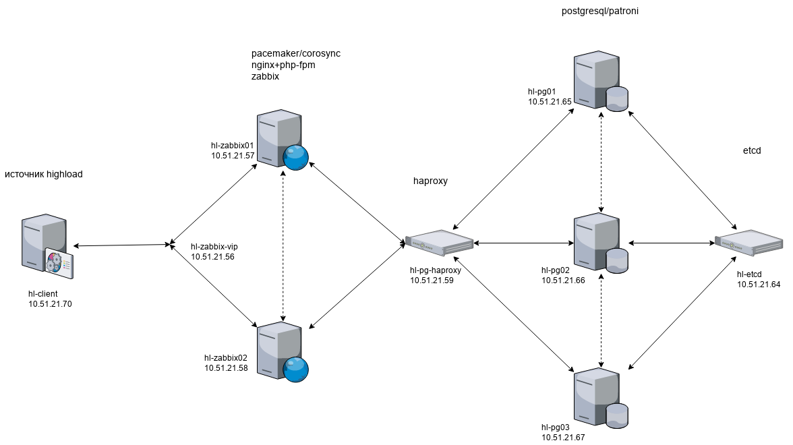
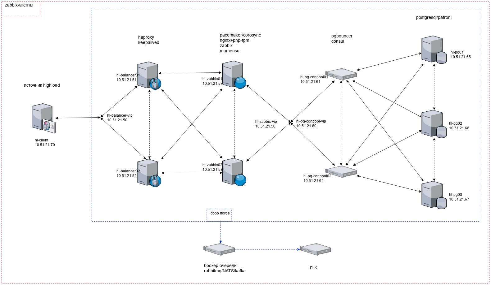

# Проектная работа "организация стенда отказоустойчивого web-приложения (Zabbix) с оптимизацией под highload"

## Задача

> организация HighLoad стэнда\
> поднимаем вебпроект\
> строим нагрузочное тестирование\
> делаем скрипты для оптимизации инфраструктуры
> 1) sysctl
> 2) кластеризация веба
> 3) оптимизация, проксирование и кластеризация базы

Внимание! Этот документ актуализируется по мере обновления проекта и только после выполнения тестов на  функциональность и корректность провижининга.

Для целенаправленного усложнения проекта мною выбран Zabbix, как вариант многокомпонентного ПО не предназначенного для работы с большим количеством http-трафика. Таким образом, highload окажется очень близко ;) и не стоит ожидать даже 500 http-rps (запросов в секунду). Так же, кластеризация компонентов под высокие нагрузки будет модернизирована для сохранения полностью работоспособной отказоустойчивой конфигурации (HA) всего проекта. При работе над проектом нет цели вносить оптимизации специфичные для Zabbix.

## Наброски архитектуры

сервера:\
точка входа и http-балансировка (2 штуки) - haproxy/keepalived или nginx\
веб (2 штуки) - приложение zabbix (pacemaker/corosync + nginx+php-fpm)\
БД прокси (1 или 2 штуки) - pgbouncer\
БД кластер (4 штуки) - postgresql+patroni+etcd\
или postgresql + consul на серверах с pgbouncer

очереди - rabbitmq/NATS/kafka\
NATS:\
[https://nats-io.github.io/docs/nats_streaming/gettingstarted/run.html](https://nats-io.github.io/docs/nats_streaming/gettingstarted/run.html)\
[https://blindwarf.com/post/nats-io/](https://blindwarf.com/post/nats-io/)\
[https://habr.com/ru/post/466263/](https://habr.com/ru/post/466263/)\
[https://github.com/devfacet/natsboard](https://github.com/devfacet/natsboard)

или\
кэш - redis или memcached

При всём при этом, в zabbix будет мониторинг всех ресурсов всех хостов + мониторинг БД + мониторинг nginx. Соответственно, при проведении тестов можно будет наглядно увидеть нагрузку на все хосты и на БД.\
~~**Возможно к работе:** Подключить в zabbix haproxy?~~

**Возможно к работе:** Вероятные изменения архитектуры стенда - сбор логов со всех серверов через брокер очередей kafka в стек ELK.

## [Тесты](tests)

можно использовать что-нибудь из этого:\
http: яндекс.танк, [https://locust.io/](https://locust.io/), Siege\
БД: sysbench, pgbench, HammerDB\
всё: [https://jmeter.apache.org/](https://jmeter.apache.org/) (redis)

## Схема проекта

текущая схема проекта


целевая схема проекта, примерно, такая:


## Текущие задачи

- [x] написать роли для оптимизации web-серверов
- [x] настроить мониторинг postgresql в zabbix
- [x] повторить с теми же параметрами нагрузочный http-тест с уже оптимизированным web, зафиксировать результаты нагрузки на сервера БД с помощью показаний zabbix
- [ ] написать роли для оптимизации БД-серверов
- [ ] развернуть pgbouncer в отказоустойчивой конфигурации (HA), соответственно, переосмыслить и изменить схему взаимодействия серверов web, БД, DCS
- [ ] заменить ```web > haproxy > postgres``` на ```web > pgbouncer > postgres```
- [ ] опять провести тест и записать результат
- [ ] вместо pgbouncer развернуть pgpool-ll?
- [x] оптимизировать настройки postgresql (в т.ч. буферы) и sysctl.conf
- [x] провести тест, записать результат, сравнить с предыдущими результатами
- [ ] задействовать TimescaleDB
- [ ] провести тест, записать результат, сравнить с предыдущими результатами

**Ожидаемый результат:** количество запросов к БД значительно уменьшилось и производительность/отзывчивость БД возросла.

## Предстоящие задачи

- [x] Переделать DCS (etcd, consul) в отказоустойчивую конфигурацию
- [x]  Со стороны highload-клиента сделать раунд-робин балансировку для web-серверов
- [ ]  zabbix - реализовать автоматическое подключение и регистрацию агентов, импорт ранее настроенных комплексных экранов и мониторинга VIP
- [ ]  Защитить web-интерфейс Consul
- [ ]  Включить firewalld на всех серверах
- [ ]  Включить SELinux на всех серверах

## Заметки

### ansible

В плейбуках ansible используются переменные, которые описаны в файле [variables](provisioning/HA/variables). Если нужно изменить имя сервера, то кроме файла variables необходимо проверить файл [hosts](provisioning_proxmox/HA/hosts) или [hosts_vagrant](provisioning/HA/hosts_vagrant) (если используется vagrant) и play-файлы плейбуков на соответствие имён серверов.
В play-файлах плейбуков учтено использование разных имён серверов из разных инвентори (hosts и hosts_vagrant).

При выполнении роли [07_zabbix_createDB](provisioning/HA/roles/07_zabbix_createDB/tasks/main.yml) происходит удаление и повторное создание БД и пользователя zabbix в postgresql, если эти объекты ранее существовали. Если этот функционал не нужен, то можно это закомментировать.

Роли для провижининга на стенд proxmox расположены в соответствующем [каталоге](provisioning_proxmox/).

### web (zabbix)

Для реализации распределения и балансировки http-трафика web-части сервера zabbix расположены на разных ВМ но настроены на работу с одним zabbix-server. При этом, отказоустойчивость web реализована избыточностью ВМ, а отказоустойчивость zabbix-server и mamonsu с помощью pacemaker/corosync.

Web-интерфейс zabbix работает на каждой ноде zabbix по адресу http://имя_или_адрес_любой_ноды:8080/zabbix. Так же, web-интерфейс доступен, в т. ч. и для нагрузочных тестов на VIP-адресе http-балансировщиков [http://hl-balancer-vip.otus/zabbix](http://hl-balancer-vip.otus/zabbix)
Дефолтные логин-пароль для доступа к web-интерфейсу zabbix ```Admin - zabbix```.

Или же сразу можно входить гостем, что и нужно будет использовать в тестах производительности
[http://hl-balancer-vip.otus/zabbix/index.php?enter=guest](http://hl-balancer-vip.otus/zabbix/index.php?enter=guest)

~~**Возможно к работе:** Необходимо синхронизировать между соответствующими серверами каталог web-интерфейса zabbix и каталог сессий php. DRBD? Можно написать systemd-юнит rsync/lsyncd для периодической синхронизации.~~

### мониторинг СУБД

Мониторинг параметров СУБД PostgreSql реализован с помощью утилиты [mamonsu](https://postgrespro.ru/products/extensions/mamonsu) от компании PotgresPro.
В моём стенде это ПО устанавливается на обе ноды сервера zabbix и настраивается на мониторинг текущего мастер-сервера БД. Конечно, в каждый момент времени работает только один экземпляр mamonsu. Это достигнуто в результате кластеризации с помощью pacemaker/corosync и введения ограничений на расположение и связанность ресурсов.

### pacemaker/corosync

Web-интерфейс кластера [https://hl-zabbix-vip.otus:2224](https://hl-zabbix-vip.otus:2224) или [https://10.51.21.56:2224](https://10.51.21.56:2224) (или https://имя_или_адрес_любой_ноды:2224)

На текущий момент кластер работает в режиме active/passive. Zabbix-агенты обращаются к ресурсу cluster_vip и на него же настроены фронтенды на обоих нодах. Таким образом, и агенты zabbix и web-части zabbix работают только с одним активным процессом zabbix-server и все обращения к БД полностью корректны.

Ресурсы кластера:

- cluster_vip - общий виртуальный ip-адрес, мониторится каждые 4 секунды
- zabbix-server - systemd-ресурс на основе zabbix_server.service, мониторится каждые 10 секунд
- mamonsu - systemd-ресурс на основе созданного нативного файла systemd-сервиса mamonsu2.service, мониторится каждые 10 секунды

Все ресурсы кластера запускаются на одной ноде.
Кластер успешно переживает жёсткое отключение одной из нод.
При убийстве любого из контролируемых сервисов (ресурсов), этот ресурс успешно поднимается на той же самой ноде в течении интервала времени, указанного при создании ресурса.

### postgresql/patroni

Кластер postgresql/patroni отказоустойчивый, но\
**Возможно к работе:** ему необходима очередь запросов - pgbouncer?\
Подключение к БД postgresql ограничено в pg_hba.conf (patroni) только сетью 10.51.21.0/24.

К сожалению, со стороны приложения (Zabbix) нет возможности каким-либо образом настроить отправку read-only запросов на другую БД.
[https://support.zabbix.com/browse/ZBXNEXT-1603](https://support.zabbix.com/browse/ZBXNEXT-1603)

### разное

ACL для haproxy от ddos

```bash
# block if 5 consecutive requests continue to come faster than 10 sess
# per second, and reset the counter as soon as the traffic slows down.
acl abuse sc0_http_req_rate gt 10
acl kill  sc0_inc_gpc0 gt 5
acl save  sc0_clr_gpc0 ge 0
tcp-request connection accept if !abuse save
tcp-request connection reject if abuse kill
```
