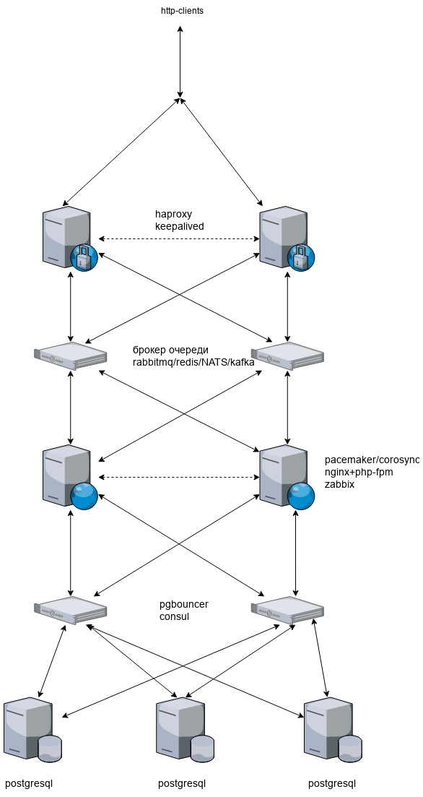

# Проектная работа "организация HighLoad стенда"

## Задача

> организация HighLoad стэнда\
> поднимаем вебпроект\
> строим нагрузочное тестирование\
> делаем скрипты для оптимизации инфраструктуры
> 1) sysctl
> 2) кластеризация веба
> 3) оптимизация, проксирование и кластеризация базы

## Наброски архитектуры

сервера:\
точка входа http и веб-прокси (2 штуки) - haproxy/keepalived или nginx\
веб (2 штуки) - приложение zabbix или glaber (pacemaker/corosync + apache или nginx+php-fpm)\
БД прокси (1 или 2 штуки) - pgbouncer\
БД кластер (4 штуки) - postgresql+patroni+etcd\
или postgresql + consul на серверах с pgbouncer

очереди - rabbitmq/NATS/kafka\
NATS:\
[https://nats-io.github.io/docs/nats_streaming/gettingstarted/run.html](https://nats-io.github.io/docs/nats_streaming/gettingstarted/run.html)\
[https://blindwarf.com/post/nats-io/](https://blindwarf.com/post/nats-io/)\
[https://habr.com/ru/post/466263/](https://habr.com/ru/post/466263/)\
[https://github.com/devfacet/natsboard](https://github.com/devfacet/natsboard)

или\
кэш - redis или memcached

При всём при этом, в zabbix (glaber) будет мониторинг всех ресурсов всех хостов + мониторинг БД + мониторинг nginx. Соответственно, при проведении тестов можно будет наглядно увидеть нагрузку на все хосты и на БД.\
Подключить в zabbix haproxy?

## Тесты

можно использовать что-нибудь из этого:\
http: яндекс.танк, [https://locust.io/](https://locust.io/)\
БД: sysbench, pgbench, HammerDB\
всё: [https://jmeter.apache.org/](https://jmeter.apache.org/) (redis)

## Схема проекта



## Заметки

Кластер postgresql отказоустойчивый, но ему необходима очередь запросов - pgbouncer?

Кластер zabbix, построенный с помощью pacemaker/corosync по-умолчанию находится в режиме active/passive и будет устойчив к сбоям, но не будет распределять нагрузку. Для распределения нагрузки необходим кластер active/active с клонированием ресурсов, которые должны быть запущены одновременно на всех нодах кластера.

ACL для haproxy от ddos

```bash
# block if 5 consecutive requests continue to come faster than 10 sess
# per second, and reset the counter as soon as the traffic slows down.
acl abuse sc0_http_req_rate gt 10
acl kill  sc0_inc_gpc0 gt 5
acl save  sc0_clr_gpc0 ge 0
tcp-request connection accept if !abuse save
tcp-request connection reject if abuse kill
```
