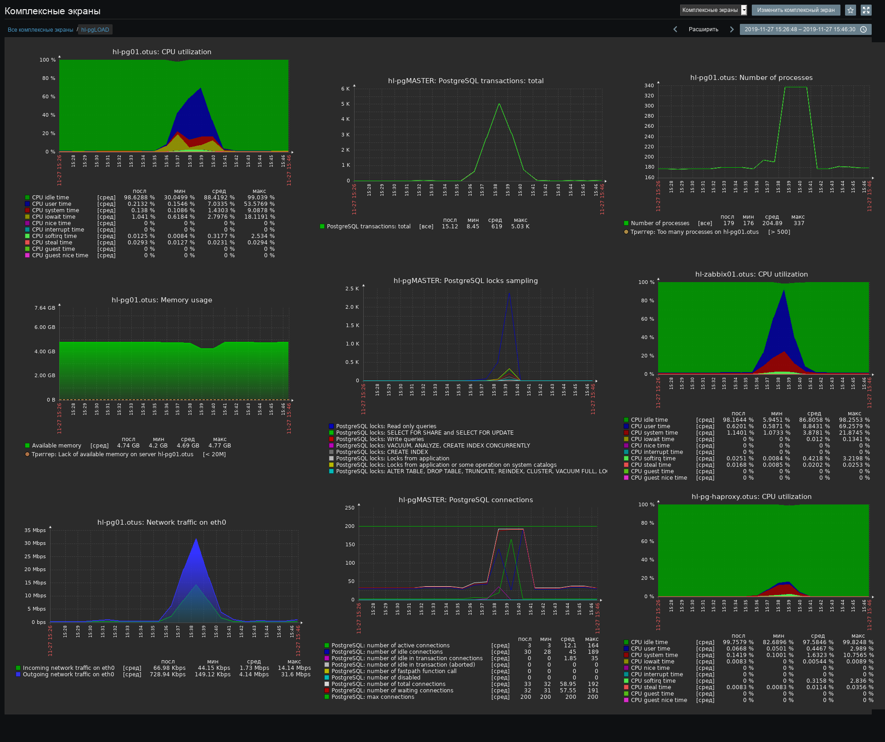
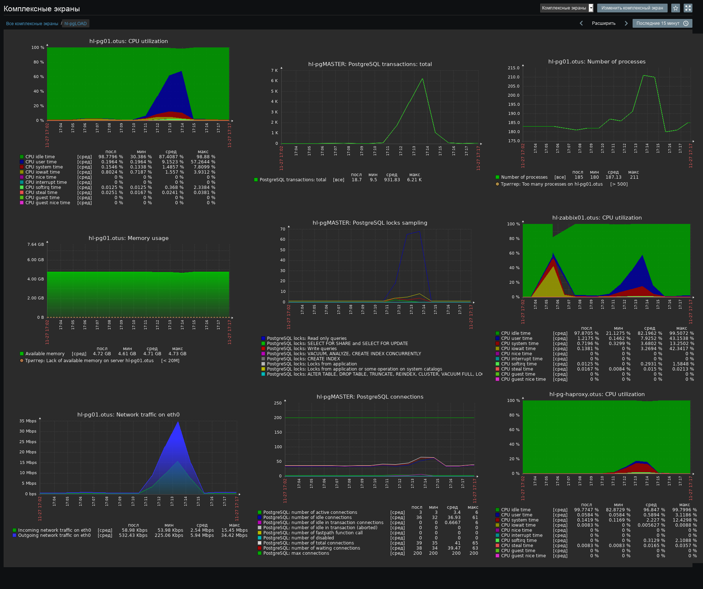

# Тестирование с увеличенным числом ядер ЦП и ОЗУ на web-серверах

Тесты были направлены на VIP-адрес http-балансировщиков, соответственно, трафик распределялся на два уже оптимизированных web-сервера.

Для автоматического перемещения VIP-адреса кластера patroni был задействован [vip-manager](https://github.com/cybertec-postgresql/vip-manager) - это ПО подключается к DCS и мониторит состояние текущего лидера в кластере. В связи с этим, соответствующим образом были перенастроены odyssey и patroni.

Во всех тестах трафик проходил по маршруту

```yandex.tank > haproxy > 2 x web > odyssey > vip-manager+postgresql```

Параметры теста - увеличение до 200 rps за 200 секунд

```yaml
schedule: line(1, 200, 200s)
```

## Тесты

### web - 2 ядра ЦП, 6 ГБ ОЗУ

сработал модуль автостопа\
в конце теста была одна взаимная блокировка\
[https://overload.yandex.net/232144](https://overload.yandex.net/232144)



### web - 4 ядра ЦП, 7 ГБ ОЗУ

[https://overload.yandex.net/232208](https://overload.yandex.net/232208)



## Результат

Так как фронтенд (относительно БД это web-сервера+zabbix-server) смог работать быстрее, то процессы php-fpm уже не удерживают соединения с БД из-за недостатка процессорных ресурсов. В связи с этим, больше, чем на тысячу увеличилось количество обработанных транзакций при уменьшении общей нагрузки на БД и, очевидно, что БД может выдержать ещё большую нагрузку. Комплексные экраны наглядно показывают разницу в используемых аппаратных ресурсах серверов и производительности БД, при этом.
