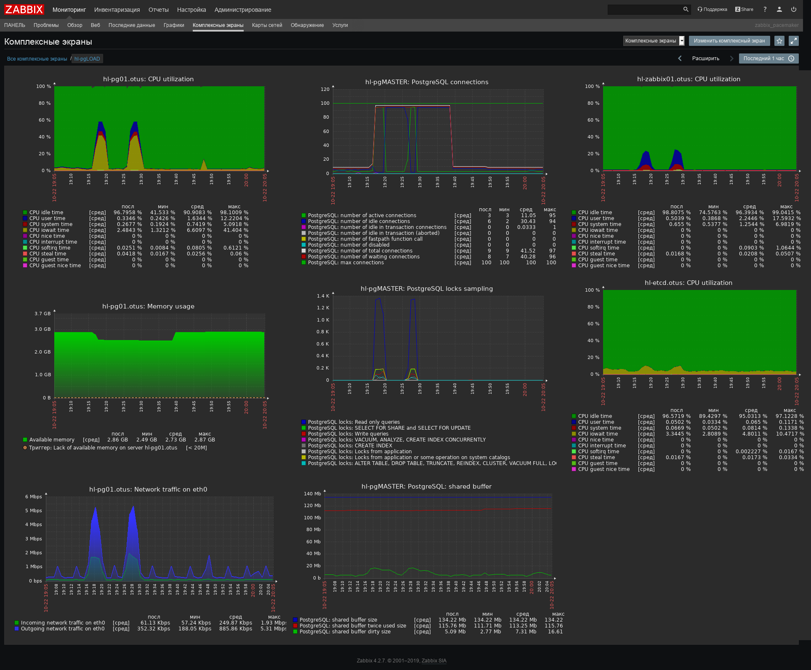

# Тестирование web - HA-кластер с http-балансировкой

Тесты были направлены на VIP-адрес http-балансировщиков, соответственно, трафик распределялся на два уже оптимизированных web-сервера. Так как количество запросов к БД возрастёт, то очевидно, что в результатах тестов узким местом будет являться БД, коим она и являлась на [предыдущем этапе](web01.md).

Web-сервера имеют 1 ядро ЦП и 2 ГБ ОЗУ.
Сервера БД - 2 ядра ЦП и 3 ГБ ОЗУ.

Конфигурация БД - по-умолчанию.

Результат теста
https://overload.yandex.net/221060

и нагрузка на ВМ


Из графиков видно, что, как и предполагалось, производительность стенда упёрлась в БД. В частности, iowait на сервере БД достигает 33,9% и количество возможных подключений к БД достигло максимального значения для текущей конфигурации БД, что подтверждается логами:

```bash
[root@hl-pg01 log]# tail -f -n 3 postgresql-Mon.log 
2019-10-21 17:45:03.162 MSK [27963] ВАЖНО:  оставшиеся слоты подключений зарезервированы для подключений суперпользователя (не для репликации)
2019-10-21 17:45:03.177 MSK [27964] ВАЖНО:  оставшиеся слоты подключений зарезервированы для подключений суперпользователя (не для репликации)
2019-10-21 17:45:03.195 MSK [27965] ВАЖНО:  оставшиеся слоты подключений зарезервированы для подключений суперпользователя (не для репликации)
```


оптимизированный web + http-балансировка + pgbouncer
zabbix = host=hl-pg01.otus port=5432 pool_size=100
https://overload.yandex.net/221490

